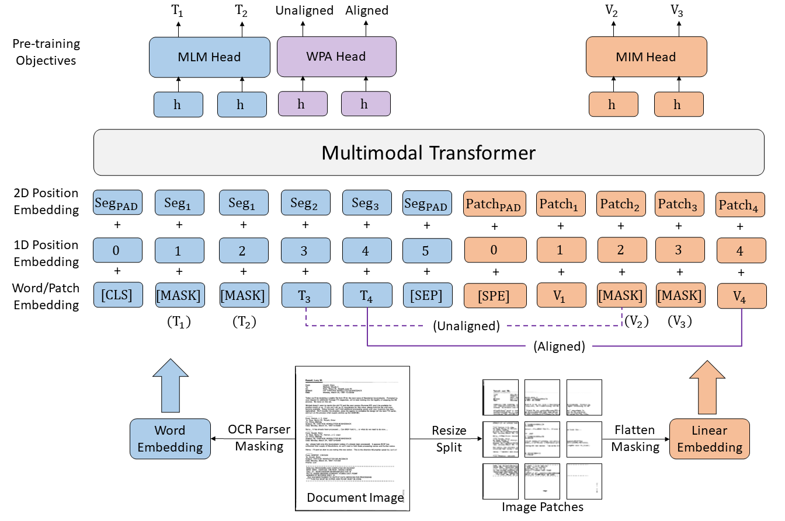

# [LayoutLMv3: Pre-training for Document AI with Unified Text and Image Masking](https://arxiv.org/abs/2204.08387)

Self-supervised pre-training techniques have achieved remarkable progress in Document AI. Most multimodal pre-trained models use a masked language modeling objective to learn bidirectional representations on the text modality, but they differ in pre-training objectives for the image modality. This discrepancy adds difficulty to multimodal representation learning. In this paper, we propose **LayoutLMv3** to pre-train multimodal Transformers for Document AI with unified text and image masking. Additionally, LayoutLMv3 is pre-trained with a word-patch alignment objective to learn cross-modal alignment by predicting whether the corresponding image patch of a text word is masked. The simple unified architecture and training objectives make LayoutLMv3 a general-purpose pre-trained model for both text-centric and image-centric Document AI tasks. Experimental results show that LayoutLMv3 achieves state-of-the-art performance not only in text-centric tasks, including form understanding, receipt understanding, and document visual question answering, but also in image-centric tasks such as document image classification and document layout analysis.



## Installation
``` bash
conda create --name layoutlmv3 python=3.7
conda activate layoutlmv3
git clone https://github.com/microsoft/unilm.git
cd unilm/layoutlmv3
pip install -r requirements.txt
# install pytorch, torchvision refer to https://pytorch.org/get-started/locally/
pip install torch==1.10.0+cu111 torchvision==0.11.1+cu111 -f https://download.pytorch.org/whl/torch_stable.html
# install detectron2 refer to https://detectron2.readthedocs.io/en/latest/tutorials/install.html
python -m pip install detectron2 -f https://dl.fbaipublicfiles.com/detectron2/wheels/cu111/torch1.10/index.html
pip install -e .
```

## Pre-trained Models
| Model            | Model Name (Path)                                                               | 
|------------------|---------------------------------------------------------------------------------|
| layoutlmv3-base  | [microsoft/layoutlmv3-base](https://huggingface.co/microsoft/layoutlmv3-base)   |
| layoutlmv3-large | [microsoft/layoutlmv3-large](https://huggingface.co/microsoft/layoutlmv3-large) |
| layoutlmv3-base-chinese | [microsoft/layoutlmv3-base-chinese](https://huggingface.co/microsoft/layoutlmv3-base-chinese) |

## Fine-tuning Examples
We provide some fine-tuned models and their train/test logs.
### Form Understanding on FUNSD
* Train
  ``` bash
  python -m torch.distributed.launch \
    --nproc_per_node=8 --master_port 4398 examples/run_funsd_cord.py \
    --dataset_name funsd \
    --do_train --do_eval \
    --model_name_or_path microsoft/layoutlmv3-base \
    --output_dir /path/to/layoutlmv3-base-finetuned-funsd \
    --segment_level_layout 1 --visual_embed 1 --input_size 224 \
    --max_steps 1000 --save_steps -1 --evaluation_strategy steps --eval_steps 100 \
    --learning_rate 1e-5 --per_device_train_batch_size 2 --gradient_accumulation_steps 1 \
    --dataloader_num_workers 8
  ```
* Test
  ``` bash
  python -m torch.distributed.launch \
    --nproc_per_node=8 --master_port 4398 examples/run_funsd_cord.py \
    --dataset_name funsd \
    --do_eval \
    --model_name_or_path HYPJUDY/layoutlmv3-base-finetuned-funsd \
    --output_dir /path/to/layoutlmv3-base-finetuned-funsd \
    --segment_level_layout 1 --visual_embed 1 --input_size 224 \
    --dataloader_num_workers 8
  ```
  | Model on FUNSD                                                                                              | precision | recall |    f1    |
  |-----------|:------------|:------:|:--------:|
  | [layoutlmv3-base-finetuned-funsd](https://huggingface.co/HYPJUDY/layoutlmv3-base-finetuned-funsd)   |   0.8955  | 0.9165 |  0.9059  | 
  | [layoutlmv3-large-finetuned-funsd](https://huggingface.co/HYPJUDY/layoutlmv3-large-finetuned-funsd) | 0.9219    | 0.9210 |  0.9215  | 

### Document Layout Detection on PubLayNet
Please follow [unilm/dit/object_detection](https://github.com/microsoft/unilm/blob/master/dit/object_detection/README.md) to prepare data and read more details about this task.
In the folder of layoutlmv3/examples/object_detecion:
* Train

  Please firstly download the [pre-trained models](#Pre-trained Models) to `/path/to/microsoft/layoutlmv3-base`, then run:
  ``` bash
  python train_net.py --config-file cascade_layoutlmv3.yaml --num-gpus 16 \
          MODEL.WEIGHTS /path/to/microsoft/layoutlmv3-base/pytorch_model.bin \
          OUTPUT_DIR /path/to/layoutlmv3-base-finetuned-publaynet
  ```
* Test 

  If you want to test the [layoutlmv3-base-finetuned-publaynet](https://huggingface.co/HYPJUDY/layoutlmv3-base-finetuned-publaynet) model, please download it to `/path/to/layoutlmv3-base-finetuned-publaynet`, then run:
  ``` bash
  python train_net.py --config-file cascade_layoutlmv3.yaml --eval-only --num-gpus 8 \
          MODEL.WEIGHTS /path/to/layoutlmv3-base-finetuned-publaynet/model_final.pth \
          OUTPUT_DIR /path/to/layoutlmv3-base-finetuned-publaynet
  ```
  | Model on PubLayNet                                                                                                  | Text   | Title       |  List  | Table | Figure | Overall |
  |-------------------------------------------------------------------------------------------|:------------|:------:|:------:|-------|--------|---------|
  | [layoutlmv3-base-finetuned-publaynet](https://huggingface.co/HYPJUDY/layoutlmv3-base-finetuned-publaynet) | 94.5        | 90.6 | 95.5 |  97.9     |  97.0      |   95.1      | 

### Form Understanding on XFUND
A demo for LayoutLMv3-chinese to train and evaluate model.
#### Data Preparation
Download the chinese data in XFUND from this [link](https://github.com/doc-analysis/XFUND/releases/tag/v1.0). 
The resulting directory structure looks like the following:
```
│── data
│   ├── zh.train.json
│   ├── zh.val.json
│   └── images
│      ├── zh_train_*.jpg
│      └── zh_val_*.jpg
```
* Train
  ``` bash
    python -m torch.distributed.launch \
      --nproc_per_node=8 --master_port 4398 examples/run_xfund.py \
      --data_dir data --language zh \
      --do_train --do_eval \
      --model_name_or_path microsoft/layoutlmv3-base-chinese \
      --output_dir path/to/output \
      --segment_level_layout 1 --visual_embed 1 --input_size 224 \
      --max_steps 1000 --save_steps -1 --evaluation_strategy steps --eval_steps 20 \
      --learning_rate 7e-5 --per_device_train_batch_size 2 --gradient_accumulation_steps 1 \
      --dataloader_num_workers 8
  ```

* Test
  ``` bash
  python -m torch.distributed.launch \
    --nproc_per_node=8 --master_port 4398 examples/run_xfund.py \
    --data_dir data --language zh \
    --do_eval \
    --model_name_or_path path/to/model \
    --output_dir /path/to/output \
    --segment_level_layout 1 --visual_embed 1 --input_size 224 \
    --dataloader_num_workers 8
  ```
  
  | Pre-trained Model | precision | recall |    f1    |
  |-----------|:------------|:------:|:--------:|
  | [layoutlmv3-base-chinese](https://huggingface.co/microsoft/layoutlmv3-base-chinese)   |   0.8910  | 0.9374 |  0.9136  |  

We also provide the scores on [EPHOIE](https://github.com/HCIILAB/EPHOIE) for reference.
  
  | Pre-trained Model  | Subject | Test Time |    Name    | School | Examination Number | Seat Number | Class | Student Number | Grade | Score | **Mean** |        
  |-----------------|:------------|:------:|:--------:|:--------:|:--------:|:--------:|:--------:|:--------:|:--------:|:--------:|:--------:|
  | [layoutlmv3-base-chinese](https://huggingface.co/microsoft/layoutlmv3-base-chinese)   |   98.48 | 100 | 99.36 | 98.86 | 100 | 100 | 98.73 | 98.89 | 97.59 | 97.78 | 98.97 |
  


## Citation
If you find LayoutLMv3 helpful, please cite us:
```
@article{huang2022layoutlmv3,
      title={LayoutLMv3: Pre-training for Document AI with Unified Text and Image Masking}, 
      author={Yupan Huang and Tengchao Lv and Lei Cui and Yutong Lu and Furu Wei},
      year={2022},
      eprint={2204.08387},
      archivePrefix={arXiv},
      primaryClass={cs.CL}
}
```

## Acknowledgement
Portions of the source code are based on the [transformers](https://github.com/huggingface/transformers), 
[layoutlmv2](https://github.com/microsoft/unilm/tree/master/layoutlmv2), 
[layoutlmft](https://github.com/microsoft/unilm/tree/master/layoutlmft), 
[beit](https://github.com/microsoft/unilm/tree/master/beit),
[dit](https://github.com/microsoft/unilm/tree/master/dit)
and [Detectron2](https://github.com/facebookresearch/detectron2) projects.
We sincerely thank them for their contributions!

## License

The content of this project itself is licensed under the [Attribution-NonCommercial-ShareAlike 4.0 International (CC BY-NC-SA 4.0)](https://creativecommons.org/licenses/by-nc-sa/4.0/)
Portions of the source code are based on the [transformers](https://github.com/huggingface/transformers) project.
[Microsoft Open Source Code of Conduct](https://opensource.microsoft.com/codeofconduct)

## Contact
For help or issues using LayoutLMv3, please email [Yupan Huang](https://github.com/HYPJUDY) or submit a GitHub issue.

For other communications related to LayoutLM, please contact [Lei Cui](mailto:lecu@microsoft.com) or [Furu Wei](mailto:fuwei@microsoft.com).
