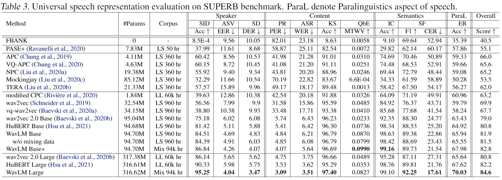
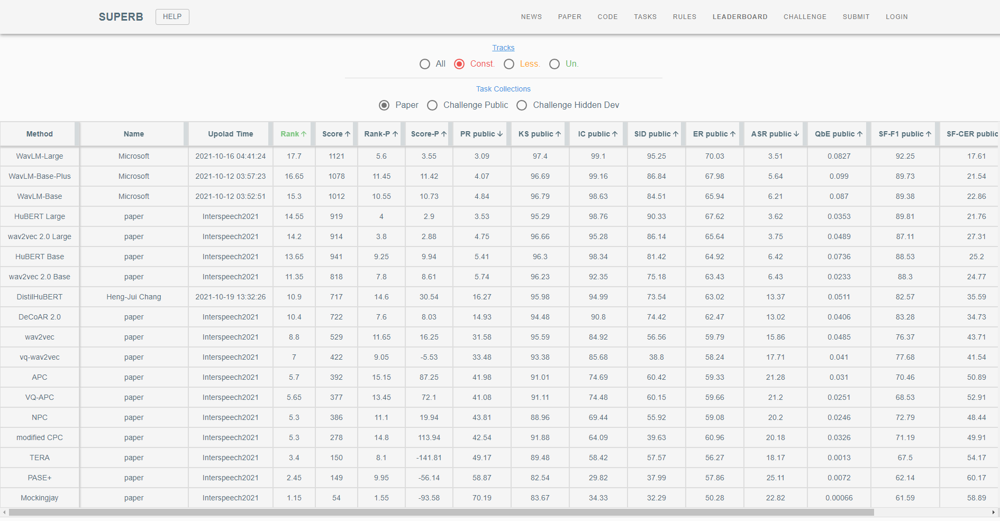
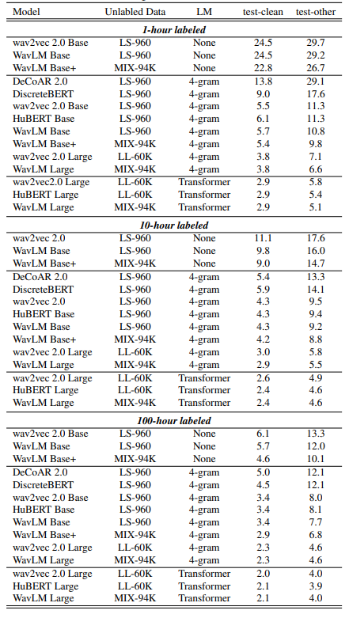

# WavLM

<!--**Pre-trained models for speech related tasks**-->


 [**WavLM**](https://arxiv.org/pdf/2110.13900.pdf): **Large-Scale Self-Supervised  Pre-training  for Full Stack Speech Processing**

Official PyTorch implementation and pretrained models of WavLM

- Nov 2021: release code and pretrained models (WavLM Base and WavLM Base+)
- Oct 2021: release preprint in [arXiv](https://arxiv.org/pdf/2110.13900.pdf)

## Pre-Trained models
Model | Pretraining Dataset | Finetuning Dataset | Model
|---|---|---|---
WavLM Base |  [960 hrs LibriSpeech](http://www.openslr.org/12)| -  | [WavLM-Base](https://drive.google.com/file/d/19-C7SMQvEFAYLG5uc47NX_MY03JCbI4x/view?usp=sharing)
WavLM Base+ | [60k hrs Libri-Light](https://github.com/facebookresearch/libri-light) + [10k hrs GigaSpeech](https://github.com/SpeechColab/GigaSpeech) + [24k hrs VoxPopuli](https://github.com/facebookresearch/voxpopuli/tree/main)| -  | [WavLM-Base+](https://drive.google.com/file/d/1H-er_Ag7KxFyB74tqguoymC7_mxQuxtS/view?usp=sharing)
WavLM Large | [60k hrs Libri-Light](https://github.com/facebookresearch/libri-light) + [10k hrs GigaSpeech](https://github.com/SpeechColab/GigaSpeech) + [24k hrs VoxPopuli](https://github.com/facebookresearch/voxpopuli/tree/main)| -  | coming soon

## Load pre-trained models

```python
import torch
from WavLM import WavLM, WavLMConfig

# load the pre-trained checkpoints
checkpoint = torch.load('/path/to/wavlm.pt')
cfg = WavLMConfig(checkpoint['cfg'])
model = WavLM(cfg)
model.load_state_dict(checkpoint['model'])
model.eval()

# extract the the representation of last layer
wav_input_16khz = torch.randn(1,10000)
rep = model.extract_features(wav_input_16khz)[0]

# extract the the representation of each layer
wav_input_16khz = torch.randn(1,10000)
rep, layer_results = model.extract_features(wav_input_16khz, output_layer=model.cfg.encoder_layers, ret_layer_results=True)[0]
layer_reps = [x.transpose(0, 1) for x, _ in layer_results]
```


## Fine-Tuning 
The authors are preparing simple, clear, and well-documented fine-tuning code of WavLM. Stay tuned!

## Universal Representation Evaluation on SUPERB 



## Downstream Task Performance 
We also evaluate our models on typical speech processing benchmarks.
### Speaker Verification

Evaluate on the [VoxCeleb](https://www.robots.ox.ac.uk/~vgg/data/voxceleb/#:~:text=VoxCeleb%20is%20an%20audio%2Dvisual,interview%20videos%20uploaded%20to%20YouTube)

| Model         |Fix pre-train| Vox1-O | Vox1-E     | Vox1-H         |
| ------------- |------------- | ---------- | ---------- | ---------- |
| ECAPA-TDNN   | - | 0.87     | 1.12  | 2.12   |
| HuBERT large  | Yes|  0.888	|0.912|	1.853 |
| Wav2Vec2.0 (XLSR)| Yes | 0.915|	0.945	|1.895|
| UniSpeech-SAT large | Yes | 0.771	| 0.781|	1.669|
| WavLM large | Yes | 0.638	| 0.687|	1.457|
| HuBERT large | No| 0.585|	0.654	|1.342|   
| Wav2Vec2.0 (XLSR) | No| 0.564|	0.605	|1.23|   
| UniSpeech-SAT large | No | 0.564 | 0.561| 1.23 |
| **WavLM large** | No | **0.431** | **0.538**| **1.154** |


### Speech Separation

Evaluation on the [LibriCSS](https://github.com/chenzhuo1011/libri_css)
| Model         |0S | 0L | OV10     |      OV20     |OV30 |OV40 |
| ---------------- |------| ------ | ------ | ------ | ------ | ------ |
| [Conformer](https://ieeexplore.ieee.org/abstract/document/9413423/) (SOTA)   | 4.5	| 4.4	|6.2	|8.5|	11	|12.6|
| HuBERT base | 4.7|	4.6	| 6.1 | 7.9|	10.6|	12.3|
| UniSpeech-SAT base | 4.4|	4.4	|5.4|	7.2|	9.2	|10.5|
| UniSpeech-SAT large | 4.3|	4.2	|5.0	|6.3|	8.2|	8.8|
| WavLM base+ | 4.5|	4.4	|5.6|	7.5|	9.4	|10.9|
| **WavLM large** | 4.2| 4.1	| 4.8	| 5.8 |	7.4|	8.5|


### Speaker Diarization

Evaluation on the [CALLHOME](https://arxiv.org/pdf/1909.06247.pdf)
| Model         |spk_2	|spk_3|	spk_4|	spk_5|	spk_6|	spk_all |
| ---------------- |------| ------ | ------ | ------ | ------ | ------ |
| [EEND-vector clustering](https://arxiv.org/pdf/2105.09040.pdf)   | 7.96|	11.93	|16.38|	21.21|	23.1	|12.49||
| [EEND-EDA clustering](https://arxiv.org/abs/2107.01545) (SOTA)  | 7.11|	11.88 |14.37|	25.95|	21.95	|11.84||
| HuBERT base| 7.93|12.07|	15.21	|19.59|	23.32|	12.63|
| HuBERT large| 7.39|	11.97|	15.76	|19.82|	22.10|	12.40|
| UniSpeech-SAT large| 5.93|	10.66|	12.9	|16.48|	23.25|	10.92|
| WavLM Base| 6.99|	11.12|	15.20	|16.48|	21.61|	11.75|
| **WavLm large** | 6.46|	10.69|	11.84	|12.89|	20.70|	10.35|

### Speech Recogntion
Evaluate on the [LibriSpeech](https://www.openslr.org/12)




## More Speech Pre-Trained  Models
Please visit [here](https://github.com/microsoft/UniSpeech) for more interesting and effective pre-trained models

## License
This project is licensed under the license found in the LICENSE file in the root directory of this source tree.
Portions of the source code are based on the [FAIRSEQ](https://github.com/pytorch/fairseq) project.

[Microsoft Open Source Code of Conduct](https://opensource.microsoft.com/codeofconduct)


### Reference
If you find our work is useful in your research, please cite the following paper:
``` latex
@article{Chen2021WavLM,
  title   = {WavLM: Large-Scale Self-Supervised  Pre-training   for Full Stack Speech Processing},
  author  = {Sanyuan Chen and Chengyi Wang and Zhengyang Chen and Yu Wu and Shujie Liu and Zhuo Chen and Jinyu Li and Naoyuki Kanda and Takuya Yoshioka and Xiong Xiao and Jian Wu and Long Zhou and Shuo Ren and Yanmin Qian and Yao Qian and Jian Wu and Michael Zeng and Furu Wei},
  eprint={2110.13900},
  archivePrefix={arXiv},
  primaryClass={cs.CL},
  year={2021}
}
```
### Contact Information

For help or issues using WavLM models, please submit a GitHub issue.

For other communications related to  WavLM, please contact Yu Wu (`yuwu1@microsoft.com`).
